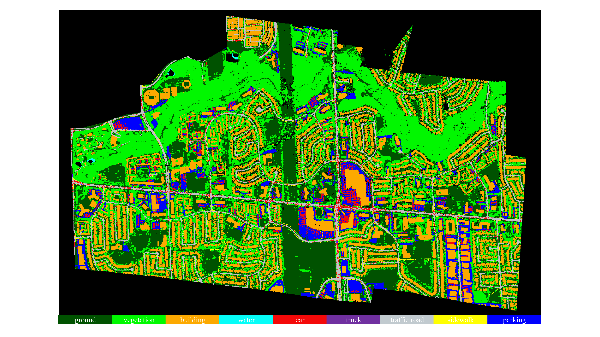

# YUTO: A Large Scale Aerial LiDAR Data Set for Semantic Segmentation
This is the official repository of the **YUTO** dataset.

  

YUTO dataset is a multi-mission large-scale aerial LiDAR dataset specifically designed for 3D point cloud semantic segmentation. The dataset comprises approximately 738 million points, covering an area of 9.46 square kilometers of York University Campus in Toronto, Ontario Canada.  Each point in the dataset is annotated with one of nine semantic classes. 

